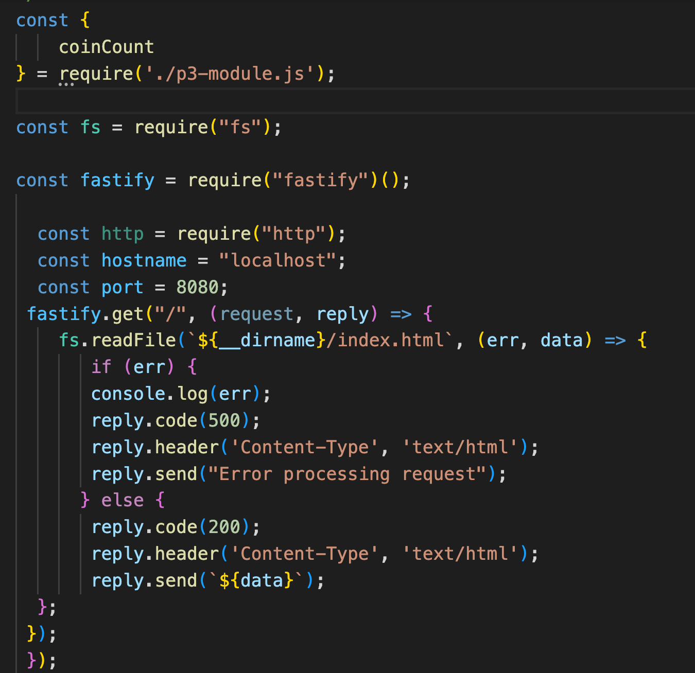

# cit281-project-3
[cit281-project-3](https://github.com/UO-CIT-qiqima/cit281-project-3)

Project 3:
We will be creating a "coinage" code module that is capable of calculating the total value of coin objects. After completing the "coinage" code module functionality, you will then update the "server" code file as a true Node.js web server using the Fastify package. The updated "server" file will display an initial web page with web links to to test the "coinage" code. The initial web page will be loaded from a file.

